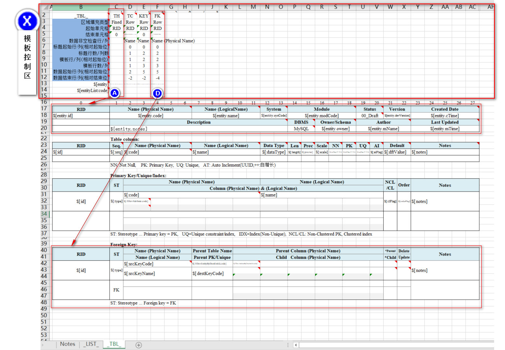
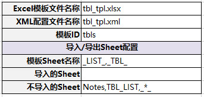

# Excel文件导入/导出工具
依据定义的Excel模板，结合程序生成相应的数据对象(POJO)，实现数据的导出为Excel文件；
反之，将按Excel模板填写的文件，通过程序生成相应的数据对象(POJO)。
 
# 一、使用步骤
## 1. 定义Excel导入/导出模板
### 1.1. 定义Excel导入/导出模板
        实例参见：tcom-poi\poi-example\data\Template\tbl_tpl.xlsx
》模板定义参见：[Excel模板定义说明](README.md#二excel模板定义说明)
### 1.2. 生成Excel导入/导出数据定义的配置文件
        通过Excel VBA读取模板定义，生成导入/导出数据定义的配置文件
        导入/导出VBA工具：tcom-poi\poi-example\data\Template\TplDefine2Xml.xlsm
        工具生成的配置文件实例：tcom-poi\poi-example\data\Template\tbl_tpl.xml

## 2. 开发Excel导入/导出程序
### 2.1. 创建Java工程（基于Spring-boot）
        实例参见：tcom-poi\poi-example
### 2.2. 放置Excel模板及配置文件
        将以上生成的Excel导入/导出模板文件，以及数据定义的配置文件放置到相应的目录；
        实例参见：tcom-poi\poi-example\src\test\resources\poi\template\*.*
### 2.3. 设置Spring配置文件及参数
        实例参见：tcom-poi\poi-example\src\test\resources\poi\spring-poi.xml
                  tcom-poi\poi-example\src\test\resources\poi\poi.properties
### 2.4. 定义数据Bean（POJO）
        实例参见Package：net.aicoder.exsys.module.entity.*
### 2.5. 开发数据导入/导出的服务
        实例参见Package: net.aicoder.exsys.module.submodule.service.*.*
### 2.6. 实例化数据导入/导出的操作对象
        实例参见Package: net.aicoder.exsys.module.submodule.dataoper.*
### 2.7. 封装Excel导入/导出的入口方法
        实例参见Package: net.aicoder.exsys.module.submodule.controller.*
### 2.8. 测试导入/导出功能(文件存放于测试目录)
        实例参见Package: net.aicoder.exsys.module.submodule.*

----------
# 二、Excel模板定义
## 1. Excel模板定义说明

### Excel模板由2大部分构成，即：
### (1) 模板控制区
"模板控制区"，定义模板的控制信息，该控制区域为1~15行，在模板定义时必须按控制区域的格式进行维护，并且该区域的行和列不能增减，一般在模板定义完成后将该区域隐藏起来，但切记该区域**【格式别动，只填内容！】**控制参数的设定从B2单元格开始，具体含义如下：
#### 1.1) Sheet定义

|单元格|示例  |    参数说明      |
| ---- | ---- | ---------------- |
|	B2	|	\_TBL\_	|	Sheet定义之ID，多Sheet之间不能重复	|
|	B3	|	区域填充类型	|	数据区定义的参数名称(仅提示用)	|
|	B4	|	起始单元格	|	数据区定义的参数名称(仅提示用)	|
|	B5	|	结束单元格	|	数据区定义的参数名称(仅提示用)	|
|	B6	|	数据非空检查行/列	|	数据区定义的参数名称(仅提示用)	|
|	B7	|	标题起始行/列(相对起始位)	|	数据区定义的参数名称(仅提示用)	|
|	B8	|	标题行数/列数	|	数据区定义的参数名称(仅提示用)	|
|	B9	|	模板行/列(相对起始位)	|	数据区定义的参数名称(仅提示用)	|
|	B10	|	模板行数/列	|	数据区定义的参数名称(仅提示用)	|
|	B11	|	数据起始行/列(相对起始位)	|	数据区定义的参数名称(仅提示用)	|
|	B12	|	数据结束行/列(相对结束位)	|	数据区定义的参数名称(仅提示用)	|
|	B13	|	\$\[entity\]	|	Sheet数据取值的变量名	|
|	B14	|	\$\[entityList:code\]	|	Sheet名称定义，可对应变量名也可为字符串常量	|

#### 1.2)  数据区域定义
本示例模板中定义了4块数据输出区域（A、B、C、D），下表以数据区域D为例进行说明。

|单元格|示例  |    参数说明      |
| ---- | ---- | ---------------- |
|	F2	|	FK	|	数据区域Ideas，同Sheet内不能重复	|
|	F3	|	Row	|	区域填充类型，共有3种： Fixed，填充方式为固定区域； Row，以行方式进行填充，可以依据List数据按行进行动态填充； Column，以列方式进行填充，可依据List数据按列进行动态填充	|
|	F4	|	=B40	|	数据区域起始单元格，通过公式引用得到数据起始单元格；**在Excel操作时，千万不能将该单元格删除，否则会报错的！**	|
|	F5	|	=AG48	|	数据区域结束单元格，结束单元格未设置【或】Row模式时与起始单元格为同一行【或】Column模式时与起始单元格为同一列，则在数据动态输出时不会复制模板所定义的行或列，而是直接向后覆盖！ **在Excel操作时，千万不能将该单元格删除，否则会报错的！**	|
|	F6	|	=D40	|	数据非空检查行/列（该定义保留），目前直接在单元格数据进行定义	|
|	F7	|	0	|	标题起始行/列(相对起始位)	|
|	F8	|	2	|	标题行数/列数	|
|	F9	|	2	|	模板行/列(相对起始位)	|
|	F10	|	3	|	模板行数/列	|
|	F11	|	2	|	数据起始行/列(相对起始位)	|
|	F12	|	\-1	|	数据结束行/列(相对结束位)	|
|	F13	|	\$\[entity.TDevEntRelationsForSrcEntId\]\{\*net.aicoder.exsys.module.entity.TDevEntRelation\}	|	数据区域对应的变量名	|

### (2) 数据区域
#### 2.1) 数据定义写在哪
	导入/导出单元格对应数据数据定义的设置，既可以直接写在单元格之中，当该单元格存在公式或者有数据校验无法将数据定义写入时，也可写在该单元格的备注内容上。
	注意：数据定义必须以\$\[开头,并且在备注内容上不能有作者信息，而是直接顶格填写定义内容。
	
#### 2.2) 如何进行数据定义
- 数据定义的组成元素有： 
变量名，变量类名，该栏位是否不为空，子数据区的定义

- 变量名定义 
实例：\$\[:id\], 表示该变量为List中成员对象的属性名称，并且该情景下变量名是可以从上级变量续接的，即：单元格可从数据区域续接上，数据区域可从当前Sheet定义的变量进行续接。
实例：\$\[entity.id\]，表示该变量为entity对象的属性名称。
实例：\$\[:nnFlag,(Y=V)\]，其中(Y=V)表示导入\导出时进行数据转换的规则，即对象的数据值为Y时Excel显示值为V，导入时依据Excel的值转换为对象的数据值

- 变量类名
实例：\{\*net.aicoder.exsys.module.entity.TDevKeyAttribute\}，定义当前变量所属的Class，如果前面有\*号，表示该变量是List类型，可动态输出

- 该栏位是否不为空，固定值为：\<notNull="Y"\>
该栏位是否不为空，表示：该字段作为数据导入时判断动态数据是否结束的标识。

- 子数据区的定义
作为数据区域内部循环的子数据区的定义，含义与以上 [1.2)  数据区域定义](README.md#1.2\)  数据区域定义) 一致。
实例：\<Area id="FK.AR" fillModel="Column" beginCell="L42" endCell="V44" variable="\$\[entity.TDevEntRelationsForSrcEntId:TDevErAttributes\]\{\*net.aicoder.exsys.module.entity.TDevErAttribute\}" \>

## 2. 生成数据定义的配置文件
        通过Excel VBA读取模板定义，生成导入/导出数据定义的配置文件
        导入/导出VBA工具：tcom-poi\poi-example\data\Template\TplDefine2Xml.xlsm
        工具生成的配置文件实例：tcom-poi\poi-example\data\Template\tbl_tpl.xml
### 配置参数设定

说明：
- Excel模板文件名称，模板文件的名称
- XML配置文件名称，生成配置文件名设置

- 模板ID，输出文件模板的标识，对应Workbook，生成
- 模板Sheet名称，所定义模板Sheet的名称，一般模板定义完成后，将相应模板Sheet隐藏
- 导入的Sheet，哪些Sheet会参与数据导入，有多个Sheet时用逗号分隔
- 不导入的Sheet，数据导入时不会导入的Sheet，有多个Sheet时用逗号分隔
以上配置对应生成数据的内容为：\<Book id="tbls" tplSheets="\_LIST\_,\_TBL\_" notImportSheets="Notes,TBL\_LIST,\_*\_" >

		

	

